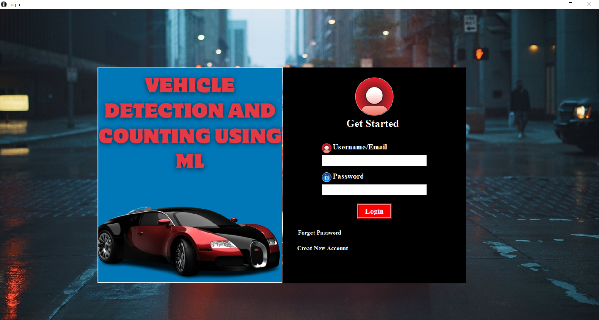

# Vehicle Detection And Counting Using Machine Learning

The aim of implementing Vehicle Detection System is to reduce time and increase efficiency of the current Parking Management System. In overpopulated cosmopolitan zones, parking strategies must be well implemented for management of vehicles. The system provides details of the vacant
parking slots in the vicinity and reduces the traffic issues due to illegal parking in the vicinity. It
is designed with an objective to meet the requirements of controlled parking that offers effortless
parking tactics to the authorities. Our parking guidance system helps in informing users about the
availability of parking slots and location of vacant slots. 

## Acknowledgements

 - A machine learning algorithm that is widely used in many areas of today’s daily life. It is robust performance and ready-made frameworks and architectures allow many people to develop various software or systems based on machine learning to support human tasks and activities.

 -  Traffic monitoring is one area that uses machine learning for several purposes. Using cameras installed in some places on the roads, many tasks such as vehicle counting, vehicle identification, traffic violation monitoring, vehicle speed monitoring, etc.
 - This research aims to create a simple vehicle counting system to help people count vehicles entering on the parking lot. Vehicle detection solutions for traffic management and parking help communities and businesses are implementing parking guidance tools, ride-sharing programs and intelligent transportation systems (ITS) that help improve mobility and alleviate parking problems.

 #### Keywords: - Vehicle, Counting, Detection, Parking, Machine learning

## Screenshots

## Features

- Video-Based Detection: Utilizes cameras to capture real-time footage and employs image processing algorithms to detect vehicles.
- Real-time Tracking: Continuously monitors and tracks the movement of vehicles within the designated area.
- Vehicle Counting: Keeps track of the number of vehicles passing through a specific area or lane.
- High Accuracy: Provides accurate results to ensure reliable data for traffic analysis and management.
- Scalability: Capable of handling different traffic volumes and can be easily expanded for larger areas.

## Technologies Used
- Python
- OpenCV
- Yolo v3

## Contributing

Contributions to the project are welcome! If you find any issues or have suggestions for improvement, please open an issue or submit a pull request.

